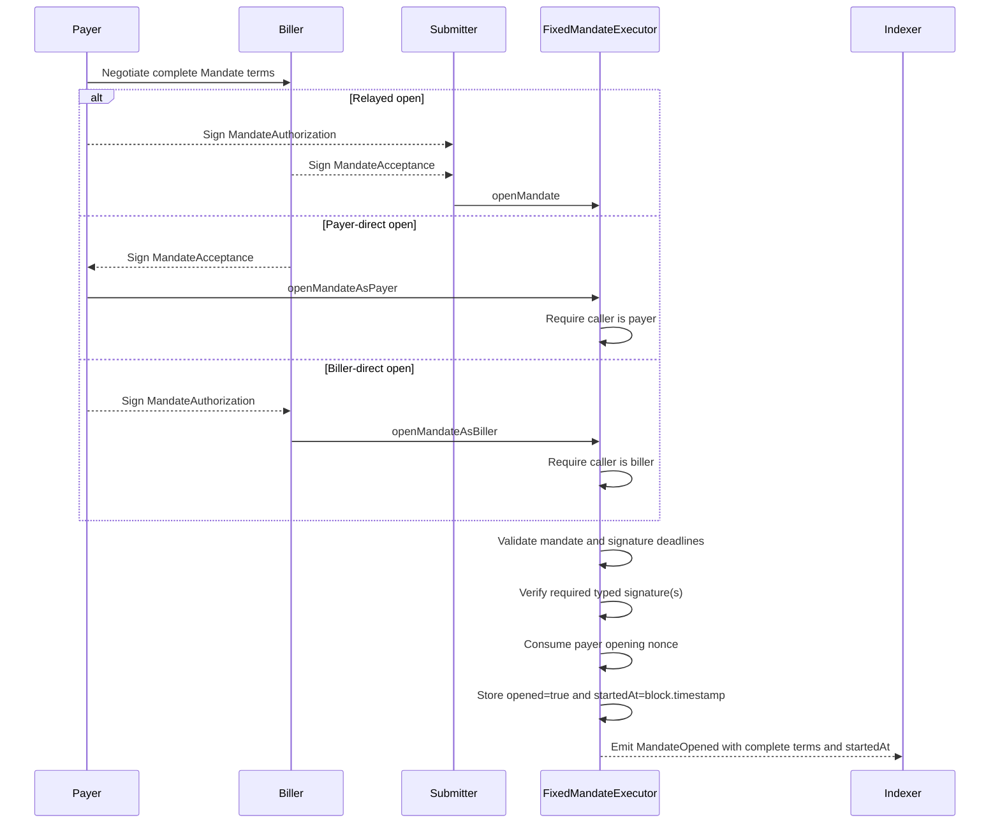
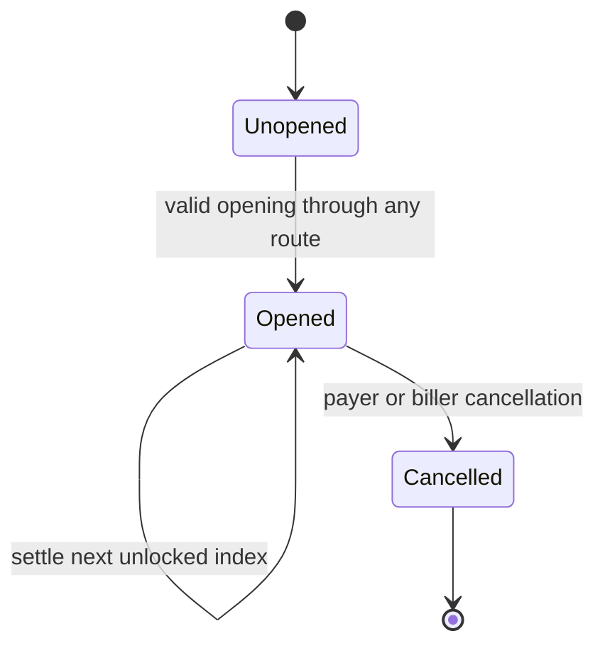
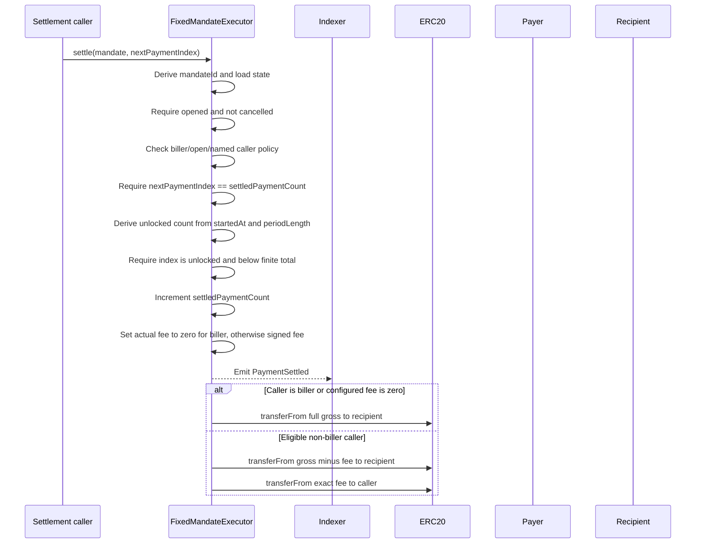
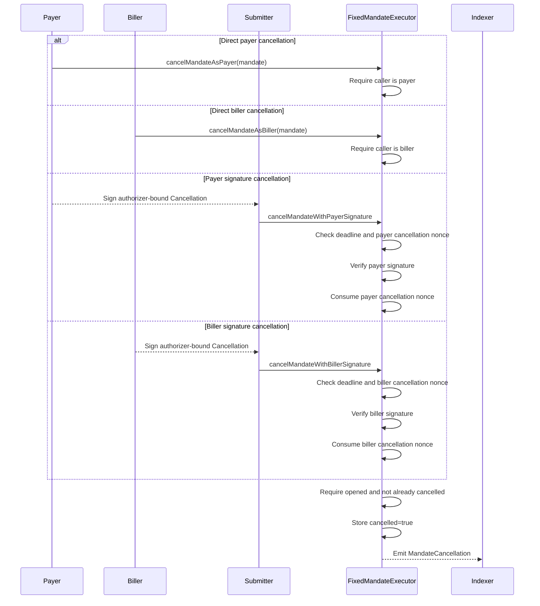

# Fixed Mandate Executor Protocol

This document is the developer and agent guide for the implementation in this repository. It describes the protocol
intent, contract architecture, public surface, state transitions, integration flows, indexing model, and security
boundary.

The working whitepaper in [WHITEPAPER-WIP.md](./WHITEPAPER-WIP.md) explains the product thesis. This file describes the
reference implementation that exists today.

## Current Status

`FixedMandateExecutor` is a Foundry reference implementation for wallet-native recurring payments over existing ERC-20
allowances. It is one immutable shared spender deployed independently on each supported chain.

The executor is intentionally small:

- no owner, proxy, upgrade path, admin pause, or rescue path;
- no custody or vault balances;
- no arbitrary external calldata execution;
- any nonzero token address can be signed into a mandate as permissionless input;
- token interactions are limited to ERC-20 `transferFrom` against the token address in the signed mandate; and
- schedule state, EIP-712 domain separation, opening nonces, and cancellation nonces belong to this deployment.

The implementation is [src/FixedMandateExecutor.sol](./src/FixedMandateExecutor.sol), and its public surface is
[src/interfaces/IFixedMandateExecutor.sol](./src/interfaces/IFixedMandateExecutor.sol). Shared signature and nonce logic
lives in [src/Signatures.sol](./src/Signatures.sol) and [src/UnorderedNonces.sol](./src/UnorderedNonces.sol).

This is a prototype/reference implementation. It is not audited and should not be deployed with meaningful funds until
external review.

## Purpose

A raw ERC-20 allowance says:

```text
spender may transfer up to X tokens
```

A fixed mandate narrows that allowance into a bilateral recurring-payment right:

```text
pull this exact gross amount from this payer
use only this token
pay only this recipient
unlock one occurrence at this fixed cadence
allow this biller and the signed external-settler policy to initiate settlement
pay at most the exact signed fee from within payer gross
stop after the signed finite count, or continue until cancellation when the count is zero
require the next sequential payment index
stop this mandate when the payer or biller cancels it
```

Opening generates the schedule start and unlocks the first occurrence immediately. Each elapsed period unlocks another
occurrence. An unlocked occurrence does not expire: missed payments remain available for sequential catch-up until the
mandate is cancelled. Cancellation does not revoke the underlying token allowance.

## Actors

| Actor | Role |
|---|---|
| Payer | Token holder whose ERC-20 allowance is spent. Authorizes mandate terms or calls directly, and may cancel. |
| Biller | Commercial counterparty that accepts mandate terms, always retains direct settlement authority, and may cancel. |
| Recipient | Address pinned by the mandate as the destination of payer gross minus any nominal external-settler fee. |
| Settler | External settlement caller and nominal fee destination. A named settler restricts external settlement; zero permits any caller. |
| Submitter | Any address that submits a relayed `openMandate`. It receives no party authority by doing so. |
| Executor | Immutable onchain verifier, schedule state machine, and ERC-20 transfer coordinator. |
| Token | ERC-20 address signed into the mandate. Economic guarantees assume standard transfer semantics. |
| Wallet/indexer | Offchain software that prepares typed data, displays exposure, tracks events, and helps users cancel or revoke allowance. |

The biller is not treated as an external settler. A biller may settle regardless of the signed `settler`, but its call
always waives `settlerFeePerPayment` and requests a full-gross transfer to the recipient.

## Contract Surface

### Functions

| Function | Caller | Meaning |
|---|---|---|
| `openMandate` | Anyone | Open using payer authorization and biller acceptance. |
| `openMandateAsPayer` | Payer | Open using payer transaction authority and biller acceptance. |
| `openMandateAsBiller` | Biller | Open using biller transaction authority and payer authorization. |
| `settle` | Biller, named settler, or anyone when settlement is open | Settle exactly the next unlocked payment index. |
| `cancelMandate` | Payer | Cancel one opened mandate using direct transaction authority. |
| `cancelMandateAsBiller` | Biller | Cancel one opened mandate using direct transaction authority. |
| `cancelMandateWithPayerSignature` | Anyone | Cancel using payer typed authorization. |
| `cancelMandateWithBillerSignature` | Anyone | Cancel using biller typed authorization. |
| `invalidateUnorderedNonces` | Payer | OR a submitted mask into opening-nonce bits owned by the caller. |
| `DOMAIN_SEPARATOR` | View | Return this executor's EIP-712 domain separator. |
| `eip712Domain` | View | Return this executor's EIP-5267 domain fields. |
| `mandateId` | View | Return the EIP-712 fixed-mandate digest used as the state key. |
| `hashMandateAuthorization` | View | Return the payer opening-authorization digest. |
| `hashMandateAcceptance` | View | Return the biller opening-acceptance digest. |
| `hashCancellation` | View | Return an authorizer-bound cancellation digest. |
| `unlockedPaymentCount` | View | Return the number of occurrences unlocked for an opened, uncancelled mandate. |

### Public State

| Getter | Meaning |
|---|---|
| `mandateStates(bytes32)` | Open/cancel flags, generated `startedAt`, and `settledPaymentCount`. |
| `nonceBitmap(address,uint248)` | Per-owner unordered opening-nonce bitmap. |
| `cancellationNonceUsed(address,uint256)` | Per-authorizer cancellation-signature replay protection. |

`unlockedPaymentCount` reverts when the supplied mandate has not opened or has been cancelled. The mandate state getter
remains readable after cancellation.

## Core Data

### Fixed Mandate

`Mandate` contains every signed commercial and schedule term:

```solidity
struct Mandate {
    address payer;
    address biller;
    address recipient;
    address settler;
    address token;
    uint256 payerGrossPerPayment;
    uint256 settlerFeePerPayment;
    uint256 periodLength;
    uint256 totalPayments;
    bytes32 termsHash;
    uint256 nonce;
}
```

Validation rules are:

- `payer`, `biller`, `recipient`, and `token` must be nonzero;
- `settler == address(0)` permits any non-biller caller to settle;
- a nonzero `settler` restricts external settlement to that exact address;
- the biller may always settle, independently of `settler`;
- `payerGrossPerPayment` and `periodLength` must be nonzero;
- `settlerFeePerPayment` may be zero but must be less than `payerGrossPerPayment`;
- if `settler == biller`, `settlerFeePerPayment` must be zero because biller settlement waives the fee;
- `totalPayments == 0` selects an open-ended schedule, while a positive value is the intended finite count, subject to
  the implementation limit below;
- `termsHash` must be nonzero and commits to offchain terms or metadata; and
- `nonce` is consumed from the payer's unordered opening-nonce bitmap.

The contract intentionally permits other address relationships, including payer and biller being the same address, if
the rules above hold.

The `mandateId` is the EIP-712 digest of `Mandate` under this executor's domain. It is chain-specific and
deployment-specific. The generated schedule start is deliberately absent from the signed struct.

### Fixed Mandate State

```solidity
struct MandateState {
    bool opened;
    bool cancelled;
    uint120 startedAt;
    uint120 settledPaymentCount;
}
```

`startedAt` is set to `block.timestamp` when opening succeeds. `settledPaymentCount` is both the number of successfully
settled occurrences and the only valid next payment index. Opening and cancellation are permanent flags; finite
schedule completion is derived from the signed total and settled count rather than stored as a separate state.

### Payment-count implementation limit

The signed `totalPayments` field is `uint256`, while `settledPaymentCount` is stored as `uint120`. Opening currently
accepts a positive count above `type(uint120).max`, but such a mandate cannot complete because the counter cannot record
all of its occurrences. Integrations must reject those values before signing or submission. Before production, the
contract should either reject them during opening or widen the stored counter.

The same counter bounds the number of successful settlements for an open-ended mandate. That astronomical implementation
ceiling is not a payer-selected lifetime limit and must not be presented as spend protection.

## Creation

The executor exposes three creation routes over the same complete `Mandate`:

```solidity
openMandate(mandate, payerSignatureDeadline, billerSignatureDeadline, payerSignature, billerSignature)
openMandateAsPayer(mandate, billerSignatureDeadline, billerSignature)
openMandateAsBiller(mandate, payerSignatureDeadline, payerSignature)
```

`openMandate` is neutral submission. Any caller may submit, and both typed signatures are required. The direct routes
replace only the calling party's signature with transaction authority:

- `openMandateAsPayer` requires `msg.sender == mandate.payer` and verifies biller acceptance; and
- `openMandateAsBiller` requires `msg.sender == mandate.biller` and verifies payer authorization.

All routes validate the same mandate, consume the same payer nonce, derive the same id, store the current timestamp as
the schedule anchor, and emit the same `MandateOpened` event. Opening signatures are not route-bound: an ordinary
counterparty signature can be paired with the corresponding direct route.



Opening does not check token balance or allowance. A mandate may open before the payer funds the account or approves the
executor; settlement fails later if a required token transfer cannot execute.

Because `startedAt` is generated, a neutral holder of both signatures can choose when to seek inclusion while both
signatures remain valid. The block producer supplies the confirmed block timestamp that becomes the anchor. A signature
is valid at its exact deadline and expires once `block.timestamp > signatureDeadline`.

All creation routes produce identical stored and event state. To distinguish which route was used, an indexer needs the
selector of the executor call frame. The top-level transaction selector is sufficient only when the executor itself is
called directly; smart-account and router calls require a trace or decoded nested execution.

## Typed Data And Signatures

The EIP-712 domain is:

```text
name: FixedMandateExecutor
version: 1
chainId: current chain
verifyingContract: deployed executor
```

Typed objects are:

| Object | Signer | Purpose |
|---|---|---|
| `Mandate` | None directly in the current opening flow | Base struct hashed into wrappers and used to derive `mandateId`. |
| `MandateAuthorization(Mandate mandate,uint256 signatureDeadline)` | Payer | Authorizes relayed or biller-direct opening until the payer deadline. |
| `MandateAcceptance(Mandate mandate,uint256 signatureDeadline)` | Biller | Accepts the exact terms for relayed or payer-direct opening until the biller deadline. |
| `Cancellation(bytes32 mandateId,address authorizer,uint256 nonce,uint256 signatureDeadline)` | Payer or biller | Authorizes cancellation by any submitter until the cancellation deadline. |

The nested opening wrappers commit to every `Mandate` field. Any change to payer, biller, recipient, settler,
token, amount, fee, cadence, finite count, `termsHash`, or nonce changes the digest.

Contract accounts are validated exclusively through ERC-1271. This includes code-bearing delegated accounts, so a bare
ECDSA recovery cannot bypass their account policy. Addresses without code use ECDSA validation and additionally support
EIP-2098 compact signatures and `v` values of `0/1`.

Cancellation signatures bind `authorizer` to the payer or biller address selected by the submitted cancellation
entrypoint. A payer-route signature therefore cannot be replayed through the biller route merely because two ERC-1271
accounts share an owner or validation policy.

The domain's `chainId` and `verifyingContract` prevent cross-chain and cross-deployment signature replay.

## State Machine

Only opening and cancellation are stored lifecycle flags:



Opening-nonce invalidation is not a mandate state. It ORs a caller-supplied mask into the nonce bitmap; any previously
unset selected bit then blocks a mandate using that nonce from opening.

There is no pending-start or expiry state. Opening anchors the schedule and unlocks index `0` immediately. A finite
mandate within the supported count range stops unlocking after `totalPayments`, but unpaid occurrences remain
collectible while it is open. Once every finite occurrence is settled, the mandate remains opened but no further index
can pass the unlock/count check. An open-ended mandate continues unlocking until cancellation, subject to the
implementation limit documented above.

## Settlement

`settle(mandate, nextPaymentIndex)` settles exactly one occurrence:



The biller may always settle. For any other caller, `settler == address(0)` opens settlement to everyone, while a
nonzero `settler` permits only that address. The named-settler policy does not remove biller authority.

The submitted index is optimistic concurrency control. It must equal `settledPaymentCount`, so two transactions racing
for the same index cannot both succeed. The first consumes the index; the stale transaction reverts. A biller and
external settler can race, and a successful biller transaction records fee zero and can preempt the external reward.

The executor follows checks, state effects, event emission, then token interactions. If a required token transfer
reverts, the EVM rolls back the counter, event, transfers, and every nested effect.

There is no reentrancy mutex. Because the count increments before token calls, a callback cannot replay the same index.
On an open-settler mandate, however, a callback token may recursively settle one or more later already-unlocked indexes
and, when configured, receive each nested external-settler fee. Every nested invocation must independently pass caller,
next-index, unlock, and finite-total checks, and its token transfers must succeed. Under a named-settler mandate, a token
that is neither the biller nor the named settler cannot settle or receive a fee. A token explicitly signed as either
role has the corresponding signed authority.

`PaymentSettled` is emitted after its index is consumed but before token interactions. An outer index event is
therefore logged before any later index reached through its token callback. Logs for one mandate remain ordered by
`paymentIndex`, and rollback removes all affected logs if a later transfer fails.

## Cancellation

Either mandate party can cancel directly or authorize any submitter with a typed signature:



If signed cancellation later fails because the mandate is unopened or already cancelled, the nonce update rolls back
with the transaction. The settler cannot cancel. Cancellation blocks both unlocked arrears and future occurrences, but
it does not revoke ERC-20 allowance. Allowance revocation at the token is the broad emergency brake for all pulls from
that payer for that token through this executor.

## Exact Fee Policy

`payerGrossPerPayment` is the sum of the nominal `transferFrom` amounts requested for every occurrence. The fee branch
is determined solely by the caller:

```text
fee transfer amount = 0                             when caller == biller
fee transfer amount = settlerFeePerPayment          for an eligible non-biller caller
total transferFrom amount = payerGrossPerPayment
recipient transfer amount = payerGrossPerPayment - fee transfer amount
caller transfer amount = fee transfer amount
```

The fee is denominated in raw token units and routed from within payer gross. It is not added on top. Validation requires
`settlerFeePerPayment < payerGrossPerPayment`, so recipient nominal proceeds remain positive. A zero fee causes one full
gross transfer to the recipient and skips the caller transfer.

The contract permits payer, recipient, biller, and settler addresses to overlap. The formulas above specify call
amounts, not guaranteed net balance deltas: for a standard ERC-20, a transfer whose destination is also the payer is a
self-transfer that can consume allowance while leaving that address's net balance unchanged. Product profiles that
promise net recipient proceeds or a net caller reward should require the relevant addresses to be distinct.

Caller and fee configurations behave as follows:

| External-settler policy | Signed fee | Behavior |
|---|---|---|
| Named (`settler != address(0)`) | Nonzero | Exact fee is routed to the named settler; biller may settle but waives it. |
| Named | Zero | Named settler or biller may settle without an onchain reward. |
| Open (`settler == address(0)`) | Nonzero | Any non-biller may compete for the exact fee transfer; biller may settle but waives it. |
| Open | Zero | Any caller, including the biller, may settle without an onchain reward. |

If `settler == biller`, the signed fee must be zero. The biller can never receive `settlerFeePerPayment` through
`settle`, even when a different named settler was signed.

## Unlock Schedule

The contract stores `startedAt = block.timestamp` on opening. At any later timestamp, the uncapped unlocked count is:

```text
uncappedUnlocked = floor((block.timestamp - startedAt) / periodLength) + 1
```

For a finite schedule:

```text
unlockedPaymentCount = min(uncappedUnlocked, totalPayments)
```

When `totalPayments == 0`, the uncapped count is used. Index `0` is unlocked at `startedAt`; index `i` unlocks at
`startedAt + i * periodLength`.

Settlement requires both:

```text
nextPaymentIndex == settledPaymentCount
nextPaymentIndex < unlockedPaymentCount
```

Each call settles one occurrence. If three occurrences are unlocked and unpaid, three sequential calls may settle them
in the same block. There is no settlement window, minimum delay, absolute end, or expiration. A finite schedule stops
accruing after its count, while its unpaid unlocked occurrences remain collectible until cancellation. Periods are
fixed-duration seconds, not calendar months.

## Nonces

Mandate opening uses a Permit2-style unordered nonce bitmap:

```text
wordPos = uint248(nonce >> 8)
bitPos  = uint8(nonce)
bit     = 1 << bitPos
```

Opening consumes exactly one payer nonce bit. Reusing that nonce for the same or different fixed terms reverts.
`invalidateUnorderedNonces(wordPos, mask)` ORs the supplied mask into the caller's bitmap. Previously unset selected
bits become unusable; already-set bits remain set, and a zero mask changes no state but still emits an event.

Signed cancellation uses a separate mapping:

```text
cancellationNonceUsed[authorizer][cancelNonce]
```

Cancellation nonces are arbitrary values, not a required sequence. Payer and biller have independent namespaces when
they are different addresses, so both may use the same numeric cancellation nonce. If both roles are the same address,
they intentionally share authorizer identity and one cancellation namespace. Opening and cancellation storage are
separate, so the same numeric value can independently be used as an opening nonce and a cancellation nonce.

## Events And Indexing

Protocol events are the indexer boundary:

| Event | Indexed fields | Meaning |
|---|---|---|
| `MandateOpened` | `mandateId`, `payer`, `biller` | A mandate opened. Non-indexed data contains every remaining signed field plus generated `startedAt`. |
| `PaymentSettled` | `mandateId`, `paymentIndex`, `payer` | One occurrence settled. Data records biller, recipient, token, payer gross, actual fee, and caller. |
| `MandateCancellation` | `mandateId`, `payer`, `cancelledBy` | Payer or biller authorized cancellation. |
| `UnorderedNonceInvalidation` | `owner`, `wordPos` | Records the mask ORed into an owner's bitmap; `mask` is non-indexed and may be a no-op. |

`EIP712DomainChanged` is inherited through `IERC5267`. The executor's domain is immutable, so this implementation never
emits it.

`MandateOpened` contains every `Mandate` field and the generated schedule anchor, so an event-only consumer can
reconstruct the mandate without transaction calldata. Route provenance additionally requires the selector of the
executor call frame; for smart-account or router transactions that may require a trace or decoded nested execution.

For settlement, the event is emitted after the counter increments and before token interactions. This makes logs from
nested settlements appear in ascending `paymentIndex` order. Indexers may process that order directly, but should still
treat logs as final only after normal chain-confirmation policy. Any transfer revert removes the event and state update.

## Trust And Security Model

The executor is a shared spender. Token allowance remains live until the payer reduces or revokes it at the token
contract.

Under standard ERC-20 transfer semantics, the executor guarantees its own checks:

- payer and biller agreed to the same complete mandate before opening;
- each direct route derives authority only from its corresponding `msg.sender` role;
- payer opening nonces cannot replay;
- signed cancellation is bound to its authorizer and cancellation nonce;
- unopened and cancelled mandates cannot settle;
- named/open external-settler policy and independent biller authority are enforced;
- settlement consumes only the next sequential index;
- an index cannot settle before it unlocks or beyond a finite total;
- recipient, token, exact nominal payer gross, and maximum actual fee are pinned by signed terms;
- biller settlement always waives the fee;
- consuming state before token interactions prevents same-index callback replay; and
- state changes and events roll back if any required token transfer fails.

The executor does not measure token balance deltas. Its economic accounting assumes
`transferFrom(from, to, amount)` debits exactly `amount` and credits exactly `amount`. It does not guarantee:

- behavior of fee-on-transfer, rebasing, excessive-debit, pausable, blocklist, callback-heavy, malicious, or otherwise
  non-standard tokens;
- net balance outcomes implied by nominal transfer amounts when the payer is also the recipient or settlement caller;
- that an open-settler token callback cannot consume later already-unlocked occurrences and receive their fees;
- payer balance, allowance availability, merchant solvency, or successful settlement availability;
- correctness, availability, or legal enforceability of offchain content committed by `termsHash`;
- privacy of payer, biller, token, recipient, amounts, cadence, or settlement history;
- that cancellation wins a race against a pending settlement transaction;
- allowance revocation after mandate cancellation;
- calendar-month billing semantics;
- recovery from compromised payer or biller signing authority;
- a payer-selected finite lifetime count or nominal gross bound when `totalPayments == 0`; or
- protection from rapid sequential collection of already-unlocked arrears.

There is no admin pause, token registry, signer registry, proxy upgrade, or owner rescue path in core.

### Allowance Guidance

Users should approve finite amounts sized to intended exposure. For a finite mandate, account for every unpaid
occurrence, including unlocked backlog. For an open-ended mandate, choose a deliberate runway budget and replenish it
as needed.

Cancellation stops one mandate; allowance revocation stops every pull from that payer for that token through this
executor. Wallets and dashboards should display at least:

- exact gross per payment;
- currently unlocked but unpaid occurrence count and gross exposure;
- next unlock time;
- remaining finite occurrences or the fact that the schedule is open-ended;
- configured external-settler policy and fee;
- cancellation state; and
- current token allowance to the executor.

## Known Non-Goals

The current executor does not implement:

- ERC-2612, Permit2, DAI permit, or other activation adapters;
- arbitrary permit calldata execution;
- batch settlement;
- calendar-month billing;
- token allowlists or token registries;
- merchant key hierarchy or signed biller-address rotation;
- recipient registry or recipient rotation;
- privacy or omnibus settlement;
- SDK, typed-data generation helpers, wallet display helpers, indexer, dashboard, or merchant API; or
- a signed future start or collection deadline.

These belong in periphery or product layers unless the core trust boundary is deliberately changed.

## Future Work

Variable Mandate is future work. It will be designed from evidence and learnings gathered during a full-stack rollout
of `FixedMandateExecutor`; no Variable Mandate design is specified here.

## Developer Workflow

Install submodules:

```bash
git submodule update --init --recursive
```

Useful commands:

```bash
forge build
forge test -vvv
forge test --fuzz-runs 10000
forge fmt --check
```

Tests containing inline gas measurements emit committed `snapshots/*.json` files during an ordinary `forge test` run;
no separate snapshot command is required. Foundry runs tests in isolation so these measurements are accurate. Review
and commit regenerated snapshot files whenever an intentional change affects measured gas usage.

The implementation is pinned to Solidity `0.8.35`. CI and committed gas baselines use Foundry `v1.5.1`; use that
Foundry version when regenerating snapshots.

Before changing protocol behavior, update together as relevant:

- [src/FixedMandateExecutor.sol](./src/FixedMandateExecutor.sol)
- [src/interfaces/IFixedMandateExecutor.sol](./src/interfaces/IFixedMandateExecutor.sol)
- [src/Signatures.sol](./src/Signatures.sol)
- [src/UnorderedNonces.sol](./src/UnorderedNonces.sol)
- [test/FixedMandateExecutor.t.sol](./test/FixedMandateExecutor.t.sol)
- [test/FixedMandateExecutor.invariant.t.sol](./test/FixedMandateExecutor.invariant.t.sol)
- [README.md](./README.md)
- [WHITEPAPER-WIP.md](./WHITEPAPER-WIP.md)
- this file

## Agent Notes

For future agents:

- treat `PROTOCOL.md` as the current implementation guide;
- treat `WHITEPAPER-WIP.md` as the product thesis and protocol framing;
- preserve the three explicit opening routes and their shared payer nonce semantics unless creation is deliberately
  redesigned;
- preserve the generated start, immediate first unlock, sequential next-index rule, finite/open-ended count semantics,
  and biller fee waiver;
- preserve `PaymentSettled` emission after index consumption and before token interactions so callback logs remain
  index-ordered;
- treat payer or biller `msg.sender` as authority only in its corresponding direct entrypoint;
- keep direct payer and biller cancellation separate from direct mandate creation;
- do not add arbitrary external calls or generic permit calldata execution to core;
- keep permit and activation adapters outside core unless a new trust boundary is explicitly chosen; and
- update state-machine, sequence, event, security, and integration documentation whenever behavior changes.
