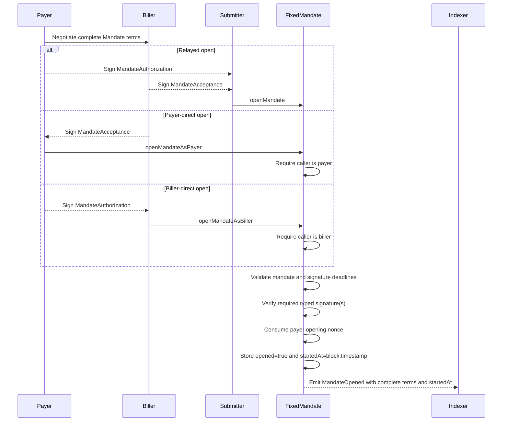
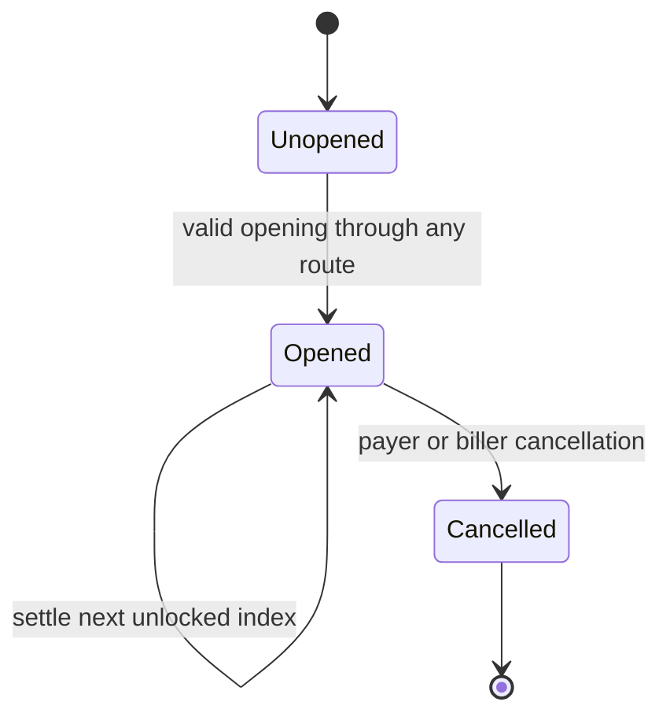
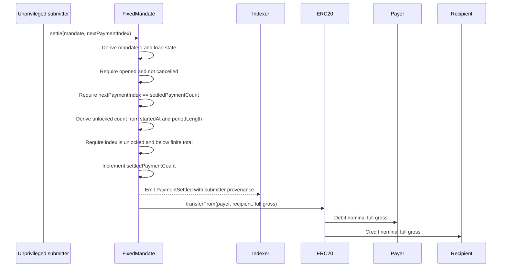
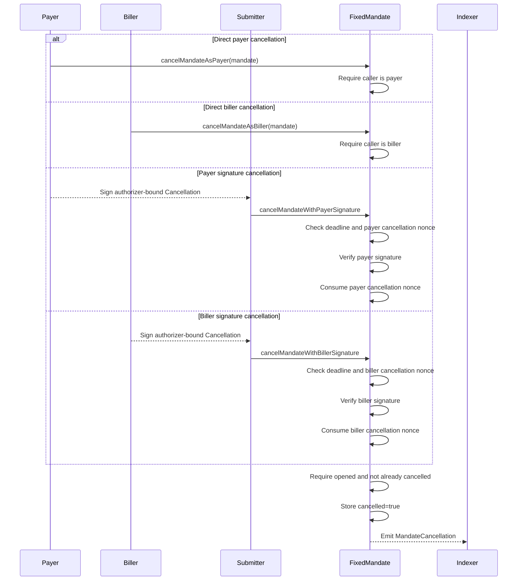

# Fixed Mandate Protocol

This document is the developer and agent guide for the implementation in this repository. It describes the protocol
intent, contract architecture, public surface, state transitions, integration flows, indexing model, and security
boundary.

The working whitepaper in [WHITEPAPER-WIP.md](./WHITEPAPER-WIP.md) explains the product thesis. This file describes the
reference implementation that exists today.

## Current Status

`FixedMandate` is a Foundry reference implementation for wallet-native recurring payments over existing ERC-20
allowances. It is one immutable shared spender deployed independently on each supported chain.

The contract is intentionally small:

- no owner, proxy, upgrade path, admin pause, or rescue path;
- no custody or vault balances;
- no arbitrary external calldata execution;
- any nonzero token address can be signed into a mandate as permissionless input;
- token interactions are limited to ERC-20 `transferFrom` against the token address in the signed mandate; and
- schedule state, EIP-712 domain separation, opening nonces, and cancellation nonces belong to this deployment.

The implementation is [src/FixedMandate.sol](./src/FixedMandate.sol), and its public surface is
[src/interfaces/IFixedMandate.sol](./src/interfaces/IFixedMandate.sol). Shared signature and nonce logic
lives in [src/Signatures.sol](./src/Signatures.sol) and [src/UnorderedNonces.sol](./src/UnorderedNonces.sol).

This is a prototype/reference implementation. It is not audited and should not be deployed with meaningful funds until
external review.

## Purpose

A raw ERC-20 allowance says:

```text
spender may transfer up to X tokens
```

A fixed mandate narrows that allowance into a bilateral recurring-payment right:

```text
pull this exact gross amount from this payer
use only this token
pay only this recipient
unlock one occurrence at this fixed cadence
allow any address to submit the exact next unlocked occurrence
transfer the full signed gross directly to the pinned recipient
stop after the signed finite count, or continue until cancellation when the count is zero
require the next sequential payment index
stop this mandate when the payer or biller cancels it
```

Opening generates the schedule start and unlocks the first occurrence immediately. Each elapsed period unlocks another
occurrence. An unlocked occurrence does not expire: missed payments remain available for sequential catch-up until the
mandate is cancelled. Any address may cause every unlocked occurrence, including arrears, to be collected immediately.
Offchain grace periods, pause requests, retry pacing, and preferred-operator policies are not enforced by the contract.
Cancellation does not revoke the underlying token allowance.

## Actors

| Actor | Role |
|---|---|
| Payer | Token holder whose ERC-20 allowance is spent. Authorizes mandate terms or calls directly, and may cancel. |
| Biller | Commercial counterparty that accepts mandate terms and may cancel. It has no special settlement authority or economics. |
| Recipient | Address pinned by the mandate as the destination of the full nominal payer gross. |
| Submitter | Any address that submits an opening, signed cancellation, or settlement transaction. Submission grants no party authority and the contract pays the submitter nothing. |
| `FixedMandate` | Immutable onchain verifier, schedule state machine, and ERC-20 transfer coordinator. |
| Token | ERC-20 address signed into the mandate. Economic guarantees assume standard transfer semantics. |
| Wallet/indexer | Offchain software that prepares typed data, displays exposure, tracks events, and helps users cancel or revoke allowance. |

Settlement submission is deliberately unprivileged. The payer, biller, recipient, a third-party service, a token
callback, or any other address may call `settle` under the same checks and economics. The immediate `msg.sender` is
recorded only as factual event provenance; it is not a signed protocol role.

## Contract Surface

### Functions

| Function | Caller | Meaning |
|---|---|---|
| `openMandate` | Anyone | Open using payer authorization and biller acceptance. |
| `openMandateAsPayer` | Payer | Open using payer transaction authority and biller acceptance. |
| `openMandateAsBiller` | Biller | Open using biller transaction authority and payer authorization. |
| `settle` | Anyone | Submit exactly the next unlocked payment index; the full gross goes to the pinned recipient. |
| `cancelMandateAsPayer` | Payer | Cancel one opened mandate using direct transaction authority. |
| `cancelMandateAsBiller` | Biller | Cancel one opened mandate using direct transaction authority. |
| `cancelMandateWithPayerSignature` | Anyone | Cancel using payer typed authorization. |
| `cancelMandateWithBillerSignature` | Anyone | Cancel using biller typed authorization. |
| `invalidateUnorderedNonces` | Payer | OR a submitted mask into opening-nonce bits owned by the caller. |
| `DOMAIN_SEPARATOR` | View | Return this contract's EIP-712 domain separator. |
| `eip712Domain` | View | Return this contract's EIP-5267 domain fields. |
| `mandateId` | View | Return the EIP-712 fixed-mandate digest used as the state key. |
| `hashMandateAuthorization` | View | Return the payer opening-authorization digest. |
| `hashMandateAcceptance` | View | Return the biller opening-acceptance digest. |
| `hashCancellation` | View | Return an authorizer-bound cancellation digest. |
| `unlockedPaymentCount` | View | Return the number of occurrences unlocked for an opened, uncancelled mandate. |

### Public State

| Getter | Meaning |
|---|---|
| `mandateStates(bytes32)` | Open/cancel flags, generated `startedAt`, and `settledPaymentCount`. |
| `nonceBitmap(address,uint248)` | Per-owner unordered opening-nonce bitmap. |
| `cancellationNonceUsed(address,uint256)` | Per-authorizer cancellation-signature replay protection. |

`unlockedPaymentCount` reverts when the supplied mandate has not opened or has been cancelled. The mandate state getter
remains readable after cancellation.

## Core Data

### Fixed Mandate

`Mandate` contains every signed commercial and schedule term:

```solidity
struct Mandate {
    address payer;
    address biller;
    address recipient;
    address token;
    uint256 payerGrossPerPayment;
    uint256 periodLength;
    uint256 totalPayments;
    bytes32 termsHash;
    uint256 nonce;
}
```

Validation rules are:

- `payer`, `biller`, `recipient`, and `token` must be nonzero;
- `payerGrossPerPayment` and `periodLength` must be nonzero;
- `totalPayments == 0` selects an open-ended schedule, while a positive value is the intended finite count, subject to
  the implementation limit below;
- `termsHash` must be nonzero and commits to offchain terms or metadata; and
- `nonce` is consumed from the payer's unordered opening-nonce bitmap.

The contract intentionally permits other address relationships, including payer and biller being the same address, if
the rules above hold.

The `mandateId` is the EIP-712 digest of `Mandate` under this contract's domain. It is chain-specific and
deployment-specific. The generated schedule start is deliberately absent from the signed struct.

### Fixed Mandate State

```solidity
struct MandateState {
    bool opened;
    bool cancelled;
    uint120 startedAt;
    uint120 settledPaymentCount;
}
```

`startedAt` is set to `block.timestamp` when opening succeeds. `settledPaymentCount` is both the number of successfully
settled occurrences and the only valid next payment index. Opening and cancellation are permanent flags; finite
schedule completion is derived from the signed total and settled count rather than stored as a separate state.

### Payment-count implementation limit

The signed `totalPayments` field is `uint256`, while `settledPaymentCount` is stored as `uint120`. Opening currently
accepts a positive count above `type(uint120).max`, but such a mandate cannot complete because the counter cannot record
all of its occurrences. Integrations must reject those values before signing or submission. Before production, the
contract should either reject them during opening or widen the stored counter.

The same counter bounds the number of successful settlements for an open-ended mandate. That astronomical implementation
ceiling is not a payer-selected lifetime limit and must not be presented as spend protection.

## Creation

`FixedMandate` exposes three creation routes over the same complete `Mandate`:

```solidity
openMandate(mandate, payerSignatureDeadline, billerSignatureDeadline, payerSignature, billerSignature)
openMandateAsPayer(mandate, billerSignatureDeadline, billerSignature)
openMandateAsBiller(mandate, payerSignatureDeadline, payerSignature)
```

`openMandate` is neutral submission. Any caller may submit, and both typed signatures are required. The direct routes
replace only the calling party's signature with transaction authority:

- `openMandateAsPayer` requires `msg.sender == mandate.payer` and verifies biller acceptance; and
- `openMandateAsBiller` requires `msg.sender == mandate.biller` and verifies payer authorization.

All routes validate the same mandate, consume the same payer nonce, derive the same id, store the current timestamp as
the schedule anchor, and emit the same `MandateOpened` event. Opening signatures are not route-bound: an ordinary
counterparty signature can be paired with the corresponding direct route.



Opening does not check token balance or allowance. A mandate may open before the payer funds the account or approves
`FixedMandate`; settlement fails later if a required token transfer cannot execute.

Because `startedAt` is generated, a neutral holder of both signatures can choose when to seek inclusion while both
signatures remain valid. The block producer supplies the confirmed block timestamp that becomes the anchor. A signature
is valid at its exact deadline and expires once `block.timestamp > signatureDeadline`.

All creation routes produce identical stored and event state. To distinguish which route was used, an indexer needs the
selector of the `FixedMandate` call frame. The top-level transaction selector is sufficient only when the contract
itself is called directly; smart-account and router calls require a trace or decoded nested execution.

## Typed Data And Signatures

The EIP-712 domain is:

```text
name: FixedMandate
version: 1
chainId: current chain
verifyingContract: deployed FixedMandate contract
```

Typed objects are:

| Object | Signer | Purpose |
|---|---|---|
| `Mandate` | None directly in the current opening flow | Base struct hashed into wrappers and used to derive `mandateId`. |
| `MandateAuthorization(Mandate mandate,uint256 signatureDeadline)` | Payer | Authorizes relayed or biller-direct opening until the payer deadline. |
| `MandateAcceptance(Mandate mandate,uint256 signatureDeadline)` | Biller | Accepts the exact terms for relayed or payer-direct opening until the biller deadline. |
| `Cancellation(bytes32 mandateId,address authorizer,uint256 nonce,uint256 signatureDeadline)` | Payer or biller | Authorizes cancellation by any submitter until the cancellation deadline. |

The canonical base and nested opening type strings are:

```text
Mandate(address payer,address biller,address recipient,address token,uint256 payerGrossPerPayment,uint256 periodLength,uint256 totalPayments,bytes32 termsHash,uint256 nonce)

MandateAuthorization(Mandate mandate,uint256 signatureDeadline)Mandate(address payer,address biller,address recipient,address token,uint256 payerGrossPerPayment,uint256 periodLength,uint256 totalPayments,bytes32 termsHash,uint256 nonce)

MandateAcceptance(Mandate mandate,uint256 signatureDeadline)Mandate(address payer,address biller,address recipient,address token,uint256 payerGrossPerPayment,uint256 periodLength,uint256 totalPayments,bytes32 termsHash,uint256 nonce)
```

Their type hashes are:

```text
Mandate:              0x18add0b5f00bbaad860472e7219507efb46c1084f6a8ab757ceda221580760bf
MandateAuthorization: 0x1a438fc38a73c4c8b9376257eefd742fc92ac50d5c909c81a143645d1809cb1a
MandateAcceptance:    0x11d52a36ac858fa40741f69247304faa44104222685420bfed13702c9d1ebf29
```

The nested opening wrappers commit to every `Mandate` field. Any change to payer, biller, recipient, token, amount,
cadence, finite count, `termsHash`, or nonce changes the digest.

Contract accounts are validated exclusively through ERC-1271. This includes code-bearing delegated accounts, so a bare
ECDSA recovery cannot bypass their account policy. Addresses without code use ECDSA validation and additionally support
EIP-2098 compact signatures and `v` values of `0/1`.

Cancellation signatures bind `authorizer` to the payer or biller address selected by the submitted cancellation
entrypoint. A payer-route signature therefore cannot be replayed through the biller route merely because two ERC-1271
accounts share an owner or validation policy.

The domain's `chainId` and `verifyingContract` prevent cross-chain and cross-deployment signature replay.

## State Machine

Only opening and cancellation are stored lifecycle flags:



Opening-nonce invalidation is not a mandate state. It ORs a caller-supplied mask into the nonce bitmap; any previously
unset selected bit then blocks a mandate using that nonce from opening.

There is no pending-start or expiry state. Opening anchors the schedule and unlocks index `0` immediately. A finite
mandate within the supported count range stops unlocking after `totalPayments`, but unpaid occurrences remain
collectible while it is open. Once every finite occurrence is settled, the mandate remains opened but no further index
can pass the unlock/count check. An open-ended mandate continues unlocking until cancellation, subject to the
implementation limit documented above.

## Settlement

`settle(mandate, nextPaymentIndex)` settles exactly one occurrence:



Settlement is permissionless: there is no caller allowlist, operator field, or special biller path. The submitter
cannot change the signed token, payer, recipient, amount, schedule, or payment index, and receives no protocol funds.
The biller can submit only because every address can submit, with identical checks and economics.

The submitted index is optimistic concurrency control. It must equal `settledPaymentCount`, so two transactions racing
for the same index cannot both succeed. The first consumes the index; the stale transaction reverts. Front-running can
change which address is recorded as `submitter`, but cannot redirect funds or alter settlement economics.

`FixedMandate` follows checks, state effects, event emission, then one token interaction. If the token transfer
reverts, the EVM rolls back the counter, event, transfers, and every nested effect.

There is no reentrancy mutex. Because the count increments before token calls, a callback cannot replay the same index.
A callback token is an address like any other and may recursively submit one or more later already-unlocked indexes.
Every nested invocation must independently pass mandate, next-index, unlock, finite-total, cancellation, and token
transfer checks. It cannot redirect payment away from the signed recipient and receives nothing from the contract.
If an outer transfer ultimately fails, all nested state, logs, and transfers roll back with it.

`PaymentSettled` is emitted after its index is consumed but before token interactions. An outer index event is
therefore logged before any later index reached through its token callback. Logs for one mandate remain ordered by
`paymentIndex`, and rollback removes all affected logs if a later transfer fails.

Because settlement is permissionless, any actor may collect index `0` as soon as opening succeeds and may collect all
unpaid unlocked arrears sequentially without waiting for an offchain instruction. Grace periods, preferred transaction
submitters, retry intervals, dunning states, and pause requests are coordination conventions only. Onchain collection
is blocked only by the protocol checks, cancellation, insufficient balance or allowance, or token failure.

## Cancellation

Either mandate party can cancel directly or authorize any submitter with a typed signature:



If signed cancellation later fails because the mandate is unopened or already cancelled, the nonce update rolls back
with the transaction. Only the payer or biller can authorize cancellation; permissionless settlement submission grants
no cancellation authority. Cancellation blocks both unlocked arrears and future occurrences, but it does not revoke
ERC-20 allowance. Allowance revocation at the token is the broad emergency brake for all pulls from that payer for that
token through this `FixedMandate` deployment.

## Settlement Accounting

Every successful occurrence requests exactly one nominal token transfer:

```text
transferFrom(payer, recipient, payerGrossPerPayment)
submitter protocol payment = 0
```

For a standard ERC-20 with distinct payer and recipient addresses:

```text
payer debit = payerGrossPerPayment
recipient credit = payerGrossPerPayment
submitter credit = 0
```

The contract has no execution fee, reward, tip, fee recipient, or biller-specific economics. The submitter pays its own
transaction costs unless some external system sponsors them; any reimbursement or commercial charge exists outside the
protocol.

The contract permits payer, recipient, and biller addresses to overlap. The formula specifies the token call, not every
possible net balance delta: if payer and recipient are the same address, a standard ERC-20 self-transfer can consume
allowance while leaving that address's net balance unchanged.

Fee-on-transfer and other non-standard tokens may produce different balance deltas even though `FixedMandate` requests
the full signed gross exactly once. That token-level behavior is an explicit compatibility boundary, not a protocol
execution fee.

## Unlock Schedule

The contract stores `startedAt = block.timestamp` on opening. At any later timestamp, the uncapped unlocked count is:

```text
uncappedUnlocked = floor((block.timestamp - startedAt) / periodLength) + 1
```

For a finite schedule:

```text
unlockedPaymentCount = min(uncappedUnlocked, totalPayments)
```

When `totalPayments == 0`, the uncapped count is used. Index `0` is unlocked at `startedAt`; index `i` unlocks at
`startedAt + i * periodLength`.

Settlement requires both:

```text
nextPaymentIndex == settledPaymentCount
nextPaymentIndex < unlockedPaymentCount
```

Each call settles one occurrence. If three occurrences are unlocked and unpaid, three sequential calls may settle them
in the same block. There is no settlement window, minimum delay, absolute end, or expiration. A finite schedule stops
accruing after its count, while its unpaid unlocked occurrences remain collectible by anyone until cancellation.
Offchain pacing cannot delay an unlocked occurrence. Periods are fixed-duration seconds, not calendar months.

## Nonces

Mandate opening uses a Permit2-style unordered nonce bitmap:

```text
wordPos = uint248(nonce >> 8)
bitPos  = uint8(nonce)
bit     = 1 << bitPos
```

Opening consumes exactly one payer nonce bit. Reusing that nonce for the same or different fixed terms reverts.
`invalidateUnorderedNonces(wordPos, mask)` ORs the supplied mask into the caller's bitmap. Previously unset selected
bits become unusable; already-set bits remain set, and a zero mask changes no state but still emits an event.

Signed cancellation uses a separate mapping:

```text
cancellationNonceUsed[authorizer][cancelNonce]
```

Cancellation nonces are arbitrary values, not a required sequence. Payer and biller have independent namespaces when
they are different addresses, so both may use the same numeric cancellation nonce. If both roles are the same address,
they intentionally share authorizer identity and one cancellation namespace. Opening and cancellation storage are
separate, so the same numeric value can independently be used as an opening nonce and a cancellation nonce.

## Events And Indexing

Protocol events are the indexer boundary:

```solidity
event MandateOpened(
    bytes32 indexed mandateId,
    address indexed payer,
    address indexed biller,
    address token,
    address recipient,
    uint256 payerGrossPerPayment,
    uint256 periodLength,
    uint256 totalPayments,
    uint256 startedAt,
    uint256 nonce,
    bytes32 termsHash
);

event PaymentSettled(
    bytes32 indexed mandateId,
    uint256 indexed paymentIndex,
    address indexed payer,
    address biller,
    address recipient,
    address token,
    uint256 payerGross,
    address submitter
);

event MandateCancellation(bytes32 indexed mandateId, address indexed payer, address indexed cancelledBy);
```

| Event | Indexed fields | Meaning |
|---|---|---|
| `MandateOpened` | `mandateId`, `payer`, `biller` | A mandate opened. Non-indexed data contains every remaining signed field plus generated `startedAt`. |
| `PaymentSettled` | `mandateId`, `paymentIndex`, `payer` | One occurrence settled. Data records biller, recipient, token, payer gross, and immediate submitter. |
| `MandateCancellation` | `mandateId`, `payer`, `cancelledBy` | Payer or biller authorized cancellation. |
| `UnorderedNonceInvalidation` | `owner`, `wordPos` | Records the mask ORed into an owner's bitmap; `mask` is non-indexed and may be a no-op. |

`EIP712DomainChanged` is inherited through `IERC5267`. The contract's domain is immutable, so this implementation never
emits it.

`MandateOpened` contains every `Mandate` field and the generated schedule anchor, so an event-only consumer can
reconstruct the mandate without transaction calldata. Route provenance additionally requires the selector of the
`FixedMandate` call frame; for smart-account or router transactions that may require a trace or decoded nested
execution.

For settlement, the event is emitted after the counter increments and before token interactions. This makes logs from
nested settlements appear in ascending `paymentIndex` order. Indexers may process that order directly, but should still
treat logs as final only after normal chain-confirmation policy. Any transfer revert removes the event and state update.
The `submitter` field is provenance only; indexers must not interpret it as an authorized role or payment recipient.

## Trust And Security Model

`FixedMandate` is a shared spender. Token allowance remains live until the payer reduces or revokes it at the token
contract.

Under standard ERC-20 transfer semantics, the contract guarantees its own checks:

- payer and biller agreed to the same complete mandate before opening;
- each direct route derives authority only from its corresponding `msg.sender` role;
- payer opening nonces cannot replay;
- signed cancellation is bound to its authorizer and cancellation nonce;
- unopened and cancelled mandates cannot settle;
- any address may submit settlement, with no special biller path;
- settlement consumes only the next sequential index;
- an index cannot settle before it unlocks or beyond a finite total;
- recipient, token, and exact nominal payer gross are pinned by signed terms;
- each successful occurrence requests one full-gross transfer to the recipient and no transfer to the submitter;
- consuming state before token interactions prevents same-index callback replay; and
- state changes and events roll back if the token transfer fails.

Permissionless collection is an intentional part of the authorization model. Once an occurrence unlocks, an adversarial
or merely unexpected address may submit it immediately, including each sequential occurrence in an arrears backlog.
The submitter cannot redirect funds or receive a protocol payment, but can choose transaction timing within the onchain
constraints. Payers and billers must sign and open mandates with that timing model in mind.

The contract does not measure token balance deltas. Its economic accounting assumes
`transferFrom(from, to, amount)` debits exactly `amount` and credits exactly `amount`. It does not guarantee:

- behavior of fee-on-transfer, rebasing, excessive-debit, pausable, blocklist, callback-heavy, malicious, or otherwise
  non-standard tokens;
- net balance outcomes implied by nominal transfer amounts when the payer is also the recipient;
- prevention of a token callback or any other address from consuming later already-unlocked occurrences;
- payer balance, allowance availability, merchant solvency, or successful settlement availability;
- correctness, availability, or legal enforceability of offchain content committed by `termsHash`;
- privacy of payer, biller, token, recipient, amounts, cadence, or settlement history;
- that cancellation wins a race against a pending settlement transaction;
- allowance revocation after mandate cancellation;
- enforcement of an offchain grace period, pause, preferred submitter, retry interval, or collection pacing policy;
- calendar-month billing semantics;
- recovery from compromised payer or biller signing authority;
- a payer-selected finite lifetime count or nominal gross bound when `totalPayments == 0`; or
- protection from rapid sequential collection of already-unlocked arrears.

There is no admin pause, token registry, signer registry, proxy upgrade, or owner rescue path in core.

### Allowance Guidance

Users should approve finite amounts sized to intended exposure. For a finite mandate, account for every unpaid
occurrence, including unlocked backlog. For an open-ended mandate, choose a deliberate runway budget and replenish it
as needed.

Cancellation stops one mandate; allowance revocation stops every pull from that payer for that token through this
`FixedMandate` deployment. Wallets and dashboards should display at least:

- exact gross per payment;
- currently unlocked but unpaid occurrence count and gross exposure;
- next unlock time;
- remaining finite occurrences or the fact that the schedule is open-ended;
- the fact that any address may immediately collect each unlocked sequential occurrence;
- cancellation state; and
- current token allowance to `FixedMandate`.

### Integration Guidance

Integrations must encode the exact nine-field `Mandate` schema and use the deployed contract address and current chain
in the EIP-712 domain. Before presenting a signature, they should make the full-gross amount, cadence, finite or
open-ended count, immediate first unlock, permissionless collection, and arrears exposure explicit.

A transaction service should read `settledPaymentCount` and the unlocked count immediately before submitting. A stale
index reverts rather than consuming a later occurrence, so competing services should treat `UnexpectedPaymentIndex` as
normal optimistic-concurrency failure and refresh state before retrying.

Monitoring, transaction submission, gas sponsorship, retries, dunning, reconciliation, service levels, and any
offchain charging arrangement are outside the protocol. Such systems may prefer or coordinate a submitter, but cannot
make that preference binding onchain. They must not infer authority or compensation from `PaymentSettled.submitter`.

To stop one mandate, submit a valid payer- or biller-authorized cancellation. To stop all pulls for a payer/token pair
through this deployment, reduce or revoke the token allowance. A private pause flag, delayed retry schedule, or
offchain instruction alone does not prevent another address from settling an unlocked occurrence.

## Known Non-Goals

The current contract does not implement:

- ERC-2612, Permit2, DAI permit, or other activation adapters;
- arbitrary permit calldata execution;
- batch settlement;
- submitter allowlists, operator delegation, or submission rewards;
- onchain grace periods, collection pacing, or pause state;
- calendar-month billing;
- token allowlists or token registries;
- merchant key hierarchy or signed biller-address rotation;
- recipient registry or recipient rotation;
- privacy or omnibus settlement;
- SDK, typed-data generation helpers, wallet display helpers, indexer, dashboard, or merchant API; or
- a signed future start or collection deadline.

These belong in periphery or product layers unless the core trust boundary is deliberately changed.

## Future Work

Variable Mandate is future work. It will be designed from evidence and learnings gathered during a full-stack rollout
of `FixedMandate`; no Variable Mandate design is specified here.

## Developer Workflow

Install submodules:

```bash
git submodule update --init --recursive
```

Useful commands:

```bash
forge build
forge test -vvv
forge test --fuzz-runs 10000
forge fmt --check
```

Tests containing inline gas measurements emit committed `snapshots/*.json` files during an ordinary `forge test` run;
no separate snapshot command is required. Foundry runs tests in isolation so these measurements are accurate. Review
and commit regenerated snapshot files whenever an intentional change affects measured gas usage.

The implementation is pinned to Solidity `0.8.35`. CI and committed gas baselines use Foundry `v1.5.1`; use that
Foundry version when regenerating snapshots.

Before changing protocol behavior, update together as relevant:

- [src/FixedMandate.sol](./src/FixedMandate.sol)
- [src/interfaces/IFixedMandate.sol](./src/interfaces/IFixedMandate.sol)
- [src/Signatures.sol](./src/Signatures.sol)
- [src/UnorderedNonces.sol](./src/UnorderedNonces.sol)
- [test/FixedMandateExecutor.t.sol](./test/FixedMandateExecutor.t.sol)
- [test/FixedMandateExecutor.invariant.t.sol](./test/FixedMandateExecutor.invariant.t.sol)
- [README.md](./README.md)
- [WHITEPAPER-WIP.md](./WHITEPAPER-WIP.md)
- this file

## Agent Notes

For future agents:

- treat `PROTOCOL.md` as the current implementation guide;
- treat `WHITEPAPER-WIP.md` as the product thesis and protocol framing;
- preserve the three explicit opening routes and their shared payer nonce semantics unless creation is deliberately
  redesigned;
- preserve the generated start, immediate first unlock, sequential next-index rule, finite/open-ended count semantics,
  permissionless submission, and one full-gross transfer to the pinned recipient;
- preserve `PaymentSettled` emission after index consumption and before token interactions so callback logs remain
  index-ordered;
- treat `PaymentSettled.submitter` as factual provenance only, never as protocol authority or a payment recipient;
- disclose that offchain grace, pause, preferred-submitter, and pacing policies cannot stop permissionless collection
  of unlocked occurrences;
- treat payer or biller `msg.sender` as authority only in its corresponding direct entrypoint;
- keep direct payer and biller cancellation separate from direct mandate creation;
- do not add arbitrary external calls or generic permit calldata execution to core;
- keep permit and activation adapters outside core unless a new trust boundary is explicitly chosen; and
- update state-machine, sequence, event, security, and integration documentation whenever behavior changes.
